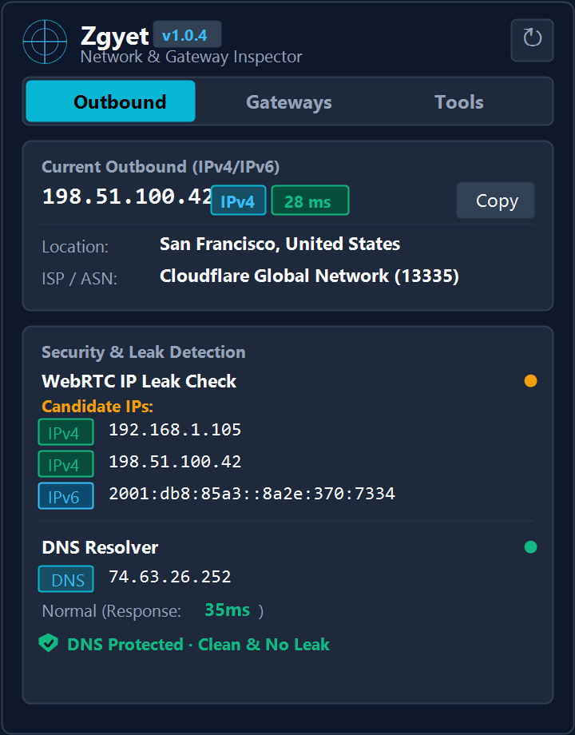
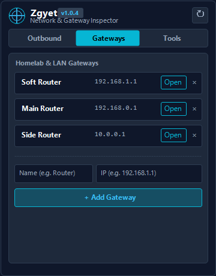
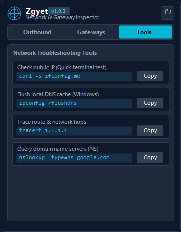
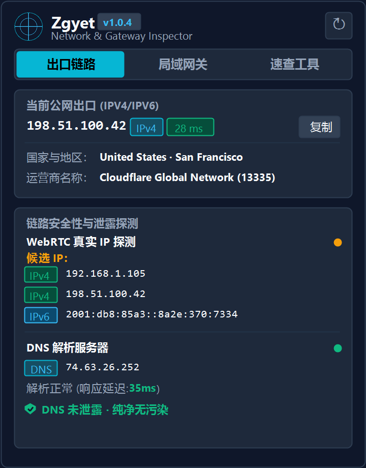
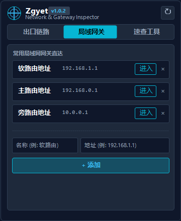
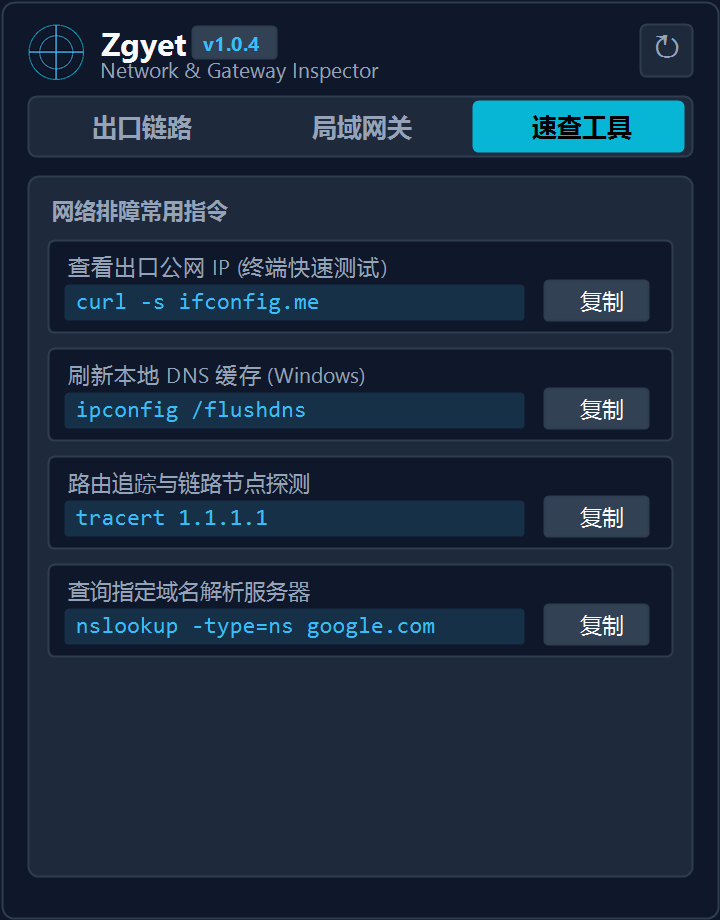

<h2>Zgyet - 网络出口与网关助手 (Outbound IP & Gateway Inspector)</h2>

> 🌐 专为 Chrome 与 Edge 打造的高性能、轻量级 Manifest V3 浏览器扩展。

> 🌐 A high-performance, privacy-first Manifest V3 browser extension for Chrome & Edge.

[](https://github.com/seanxin0126/Zgyet)
[](https://developer.chrome.com/docs/extensions/mv3/)
[](https://github.com/seanxin0126/Zgyet)
[](_locales)
[](LICENSE)

[English](#english) | [简体中文](#简体中文)

---

## English

### ✨ Features
- ⚡ **Instant Outbound IP Detection**: Ultra-fast fetching of Public IPv4 / IPv6, Location, ISP & ASN with three-tier failover endpoints.
- 🛡️ **WebRTC IP Leak Checker**: Real-time detection of WebRTC public and internal IP exposures with clean IPv4 / IPv6 sorted alignment.
- 🔍 **DNS Resolver & Real-Time Leak Check**:
  - Displays the active recursive DNS exit node IP address.
  - Color-coded response latency (`<450ms` green, `450-1000ms` yellow, `>1000ms` red).
  - Real-time **DNS Leak & Pollution/Poisoning Detection** (`DNS Protected · Clean & No Leak`).
- 🏠 **Homelab & LAN Gateways**: Built-in quick shortcuts for Soft Routers, Main Routers, and Sub-gateways, with custom one-click addition.
- 🛠️ **Network Tools & Cheatsheet**: Copyable essential network troubleshooting commands (`ipconfig`, `tracert`, `nslookup`, `curl`).
- 🌐 **Full Automatic Localization (i18n)**: Out-of-the-box support for English, 简体中文, 繁體中文, 日本語, 한국어, Deutsch, Español, and Français.
- 🪶 **Zero Telemetry & 100% Client-Side**: Pure Vanilla JS, zero third-party dependencies, <50ms instant startup.

### 📸 Screenshots
<div align="center">
  
  
  
</div>

### 📝 Changelog

#### v1.0.3 (Latest)
- ✨ **DNS Security Line**: Added real-time DNS leak and hijacking/pollution detection line with full 8-language localization.
- ⚡ **DNS IP & Dynamic Latency**: Displays recursive DNS server IP and 3-stage latency color coding (`<450ms` green, `450-1000ms` yellow, `>1000ms` red).
- 🛡️ **Zero Console Errors**: Upgraded to multi-fallback IP discovery endpoints with silent error handling to ensure clean logs in Chrome extension manager.
- 🎨 **Aesthetic Polish**: Refined English typography, column alignments, and refreshed high-resolution sanitized previews.

#### v1.0.2
- ⚡ Added dynamic response latency color thresholds.
- 🛠️ Fixed background error logging in extension management console.

#### v1.0.1
- 🌐 Added dedicated English and Chinese screenshot galleries.
- 🏷️ Standardized 5-character default gateway labels.

#### v1.0.0
- 🎉 Initial release with Manifest V3 support.

---

### 🚀 Installation & Local Debugging
1. Clone or download this repository:
   ```bash
   git clone https://github.com/seanxin0126/Zgyet.git
   ```
2. Open your browser's extension manager:
   - **Google Chrome**: navigate to `chrome://extensions`
   - **Microsoft Edge**: navigate to `edge://extensions`
3. Enable **"Developer mode"** in the top right / sidebar.
4. Click **"Load unpacked"** and select the `zgyet` folder.
5. Pin **Zgyet** to your toolbar and enjoy!

---

## 简体中文

### ✨ 功能特性
- ⚡ **公网出口 IP 极速探测**：毫秒级展示当前公网 IPv4 / IPv6、运营商（ISP）、地理位置（国家与地区）及 ASN，集成多通道秒级容灾。
- 🛡️ **WebRTC 防泄漏检测**：实时探测浏览器 WebRTC 候选 IP，严格按 IPv4 在前、IPv6 在后智能排序并首位完美对齐。
- 🔍 **DNS 服务器与安全防泄漏监测**：
  - 自动探测当前使用的递归 DNS 解析服务器真实 IP。
  - 毫秒级三段式动态响应延迟色彩提示（`<450ms` 极速绿，`450~1000ms` 中等黄，`>1000ms` 超时红）。
  - 实时检测 **DNS 泄露与污染/劫持状态**（`DNS 未泄露 · 纯净无污染` / `存在 DNS 泄露`）。
- 🏠 **常用局域网网关直达**：内置软路由地址、主路由地址、旁路由地址一键直达，支持自定义添加与回车快捷保存。
- 🛠️ **网络排障指令速查**：内置常用网络命令（`ipconfig`, `tracert`, `nslookup`, `curl` 等），支持一键复制到剪贴板。
- 🌐 **全自动多语言国际化**：内置 8 国语言包（简体中文、繁体中文、英语、日语、韩语、德语、西班牙语、法语），跟随系统语言自动切换。
- 🪶 **极致轻量无依赖**：纯原生 JS 与 CSS 编写，零第三方依赖库，总体积不足 35 KB，0 远程追踪上报。

### 📸 界面预览
<div align="center">
  
  
  
</div>

### 📝 更新日志 (Changelog)

#### v1.0.3 (最新版本)
- ✨ **DNS 安全检测行**：新增实时 DNS 泄露与劫持/污染检测状态行，支持 8 种语言本地化提示。
- ⚡ **DNS 服务器 IP 与色彩阈值**：实装递归 DNS 解析服务器 IP 展示及响应延迟三段式变色提示（`<450ms` 绿色、`450-1000ms` 黄色、`>1000ms` 红色）。
- 🛡️ **后台 0 报警优化**：接入三级高速容灾出口探测引擎，采用静默异常处理，确保扩展管理页 0 错误、0 警告。
- 🎨 **视觉与排版优化**：重构英文界面排版与标签对齐，全量更新高清脱敏 UI 预览截图。

#### v1.0.2
- ⚡ 优化 DNS 响应延迟色彩逻辑与状态灯切换。
- 🛠️ 修复扩展管理后台错误日志。

#### v1.0.1
- 🌐 完善中英文双语预览图与国际化资源包。
- 🏷️ 统一网关预设标签为 5 字符标准格式。

#### v1.0.0
- 🎉 首次正式发布，支持 Manifest V3 架构。

---

### 🚀 安装与本地加载步骤
1. 克隆或下载本项目源码：
   ```bash
   git clone https://github.com/seanxin0126/Zgyet.git
   ```
2. 打开浏览器的扩展程序管理页：
   - **Google Chrome**：在地址栏输入 `chrome://extensions`
   - **Microsoft Edge**：在地址栏输入 `edge://extensions`
3. 开启页面右上角或左侧的 **“开发者模式”** 开关。
4. 点击 **“加载已解压的扩展程序”**，选择本插件所在的文件夹。
5. 在浏览器工具栏固定 **Zgyet** 图标即可随时使用！

---

## 📄 License

MIT License © 2026 Zgyet
